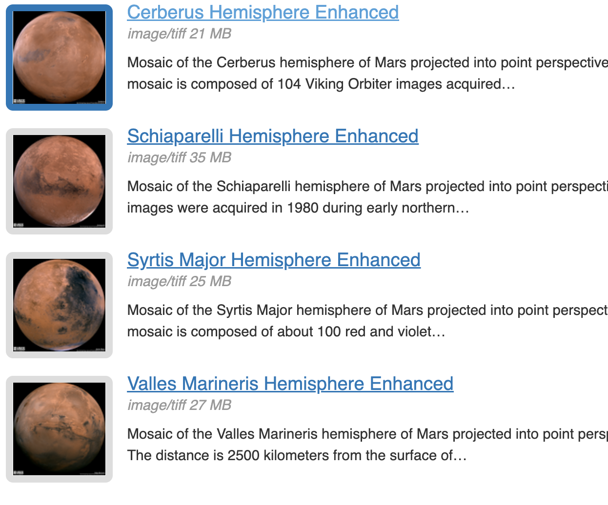

# Mission to Mars

## Overview and Purpose

Robin is seeking a solution to consolidate information about the water presence on Mars from various online sources and present it in a unified platform. Her goal is to develop a web application that utilizes a nonSQL database and Flask framework. To assist her in this endeavor, we have crafted a Python code in Jupyter Notebook that efficiently scrapes the web for images, news headlines, and facts specifically related to Mars, sourced from multiple websites. The web scraper has been successfully executed, yielding a substantial collection of images showcasing the hemispheres of Mars, which are displayed below.

## Method and Analysis

For this project, a python file was created for the scraping that would be required for the application to work. Once that was done, the file was imported onto the application file along with PyMongo and Flask. The template for the application was set as the index.html file, which was coded to display the web scraper and the images on the main site. Upon running the application on Flask, the page that opens contains a title, a background picture, a scrape button, a featured picture, a table of facts about Mars, and a section about the various hemispheres of the planet.

For the third deliverable, the html code was edited to display the web scraper in a mobile device setting.

